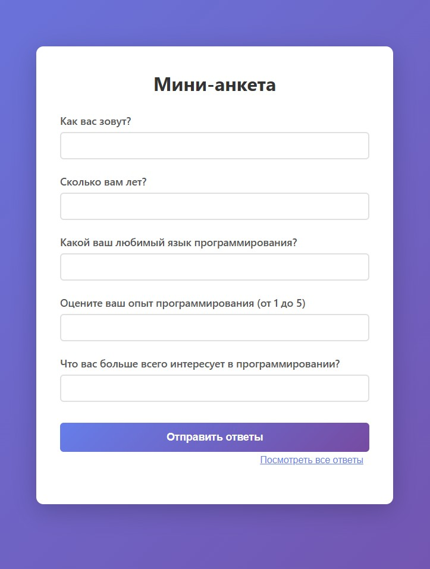
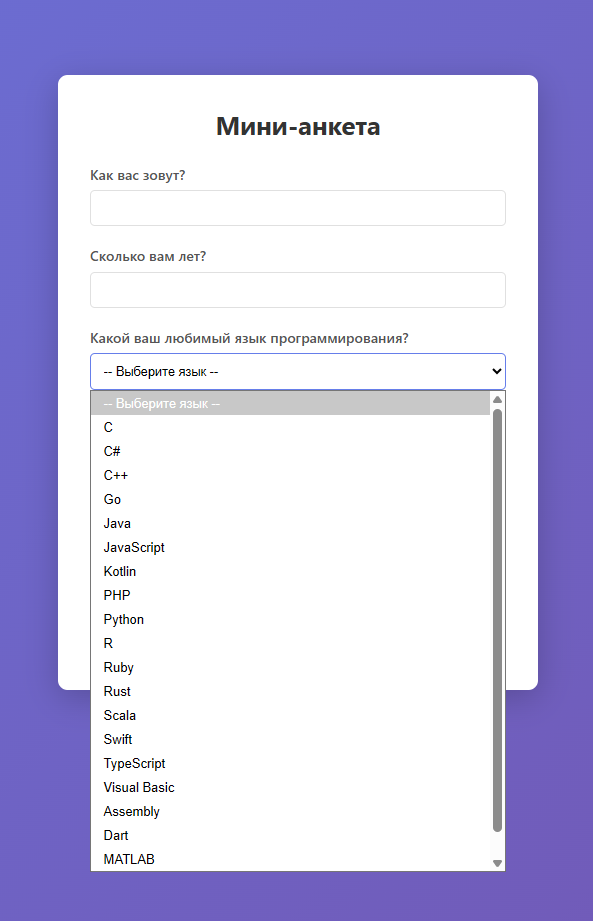
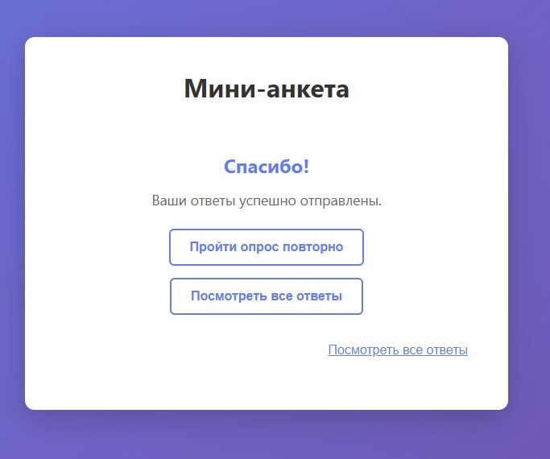
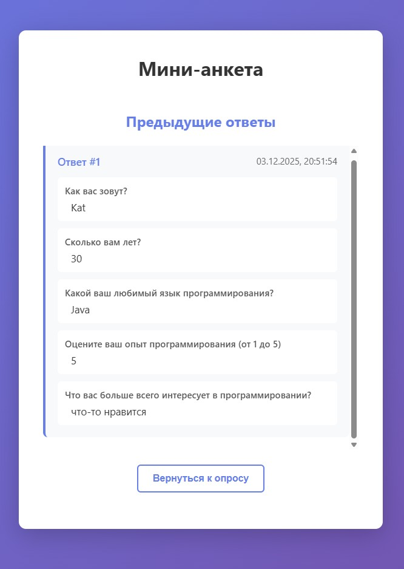

# Мини-анкета

Простое приложение для проведения анкетирования, состоящее из backend на Python (Flask) и frontend на HTML+JavaScript.

## Структура проекта

```
hw_1/
├── backend/          # Backend часть (Python Flask)
│   ├── app.py       # Основное приложение Flask
│   └── requirements.txt  # Зависимости Python
├── frontend/         # Frontend часть (HTML+JS)
│   ├── index.html   # Главная страница
│   ├── script.js    # JavaScript логика
│   └── styles.css   # Стили
└── README.md        # Документация
```

## Функционал

### Backend API

- **GET /questions** - возвращает список вопросов анкеты (5 вопросов)
- **POST /answers** - принимает ответы пользователя и сохраняет их в памяти
- **GET /answers** - дополнительный endpoint для просмотра всех сохраненных ответов (для отладки)

### Frontend

- Загружает вопросы с backend при открытии страницы
- Отображает форму с вопросами
- Отправляет заполненные ответы через POST /answers
- Показывает сообщение "Спасибо!" после успешной отправки

## Установка и запуск

### Backend

1. Перейдите в папку backend:
```bash
cd backend
```

2. Создайте виртуальное окружение (рекомендуется):
```bash
python -m venv venv
```

3. Активируйте виртуальное окружение:
   - Windows:
   ```bash
   venv\Scripts\activate
   ```
   - Linux/Mac:
   ```bash
   source venv/bin/activate
   ```

4. Установите зависимости:
```bash
pip install -r requirements.txt
```

5. Запустите сервер:
```bash
python app.py
```

Backend будет доступен по адресу: `http://localhost:5000`

### Frontend

1. Откройте файл `frontend/index.html` в браузере

   Или используйте простой HTTP-сервер (например, встроенный в Python):
   ```bash
   cd frontend
   python -m http.server 8000
   ```
   Затем откройте в браузере: `http://localhost:8000`

## Использование

1. Запустите backend сервер (см. раздел "Backend")
2. Откройте frontend в браузере
3. Заполните форму с вопросами
4. Нажмите "Отправить ответы"
5. После успешной отправки вы увидите сообщение "Спасибо!"

## Технологии

- **Backend**: Python 3, Flask, Flask-CORS
- **Frontend**: HTML5, CSS3, JavaScript (Vanilla JS)

6. Вы можете пройти опрос повторно или посмотреть все предыдущие ответы

## Скриншоты работы приложения

### Главная страница с формой опроса

<table>
<tr>
<td width="50%">

</td>
<td width="50%">

</td>
</tr>
</table>

*Форма с вопросами анкеты, готовая к заполнению*

### Сообщение после отправки ответов



*Экран "Спасибо!" с кнопками для повторного прохождения опроса и просмотра ответов*

### Просмотр всех сохраненных ответов



*Список всех ранее сохраненных ответов с датами и временем отправки*

# Разработка с использованием AI

### AI-приложение и агент

Код данного приложения был сгенерирован с использованием:
- **AI-приложение**: Cursor
- **AI-агент**: Auto (agent router от Cursor)

### Используемые промпты

В процессе разработки использовались следующие промпты:

1. **Инициальный промпт для создания приложения:**
   ```
   необходимо сгенерировать и собрать простое приложение «Мини-анкета», состоящее из backend-части и небольшого frontend-интерфейса.
   в папке backend должна храниться  backend-часть,
   в папке  frontend- frontend-интерфейс.

   Требуемый функционал

   Backend предоставляет два API:
   GET /questions — возвращает список вопросов анкеты (жёстко заданных, 3–5 шт.).
   POST /answers — принимает ответы пользователя и сохраняет их в памяти (например, в slice/array/map).

   Frontend:
   загружает вопросы с backend;
   отображает их в HTML/JS интерфейсе;
   отправляет заполненные ответы через POST /answers;
   показывает пользователю сообщение «Спасибо!» после отправки.

   Backend: Python
   Frontend: чистый HTML+JS, небольшой React/Vue или шаблон.
   ```

2. **Промпт для исправления валидации возраста:**
   ```
   на вопрос "Сколько вам лет?" позволяет ввести значение от 1 до 5, Должна быть возможность ввести любое значение от 10 до 100
   ```

3. **Промпт для добавления функционала повторного прохождения:**
   ```
   в интерфейс необходимо добавить возможность пройти опрос повторно и посмотреть ранее данные ответы
   ```

4. **Промпт для исправления бага с формой:**
   ```
   При нажатии на "Вернуться к опросу", открывается форма с последними введенными ответами вместо кнопки, оптравить "Отправка..." и возможность отправить ответ отсутсвует, заново заполнить анкету так же отсутсвует.
   Со страница ответов, должен быть переход на новую анкету. Поля должны очищаться. Должна быть возможность заново отправить ответ
   ```

5. **Промпт для улучшения UI и добавления выпадающего списка:**
   ```
   на странице "Спасибо!"  две точки перехода на "Все ответы", кнопка и ссылка под кнопкой. Оставить только одну - по кнопке.
   На форму анкеты, для вопроса "Любимые языки программирования" добавить выпадающий список для выбора ответа. В список добавить 20 самых популярных языков программирования. Упорядочить их по алфавиту
   ```

6. **Промпт для добавления скриншотов в README:**
   ```
   добавь в файл readme скриншоты работы приложения
   ```